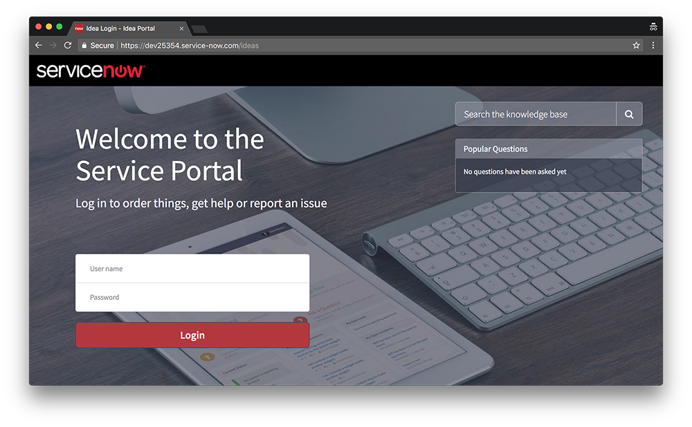

# Introduction
## What is Service Portal?
// TODO

## Service Portal Core Concepts
// TODO

# Lab 1: The Portal Record
## Goal
In this lab we will configure our Portal record, and the Theme associated with it.

## Create the Portal
1.	Open your web browser and navigate to the URL of your instance.
2. Login as `admin`.
3.	In the application navigator, search for and open **Studio**, and pick the **Idea Portal** application (this has been pre-loaded onto your instance).
4. In Studio, under the **Service Portals** heading, click on **Idea Portal**.
5. Notice the **URL Suffix** to access this portal is `ideas`.
6.	Download **[`ServiceNow.png`](resources/lab-01/ServiceNow.png)**, upload it to the **Logo** field, and press **Save**.
7.	This portal is associated with the **Idea Portal** theme. Click on the  icon next to the **Theme** field to open the record.
8. Update the Idea Portal record to have the values below, then press **Save**:

	| Field         | New Value                                 |
	|---------------|-------------------------------------------|
	| Header        | Stock Header *(we will use the OOB header)* |
	| CSS Variables | *Contents of [theme.css](scripts/lab-01/theme.css)*|

# Lab 2: Cloning and Creating Pages
## Goal
In this lab we will clone an existing page, modify it, and create new pages for our portal.

## Cloning Existing Pages
1. In the application navigator, search for **Pages**, and open the result under the **Service Portal** application.
2. Search for and open the page with the **ID** `landing`.
3. Click on the **Clone Page** button (located to the top right of the page).
4. Change the cloned page's title to **Idea Login**.
5. Copy the new title, and paste it into the **ID** field. When you click out of the field you will notice the value is automatically converted to lowercase, and spaces will be replaced with underscores. This is because the page's ID is used in the URL when accessing the page, and URL's are case insensitive and don't support spaces.
6. Press **Update**.
7. In Studio, navigate to the **Idea Portal** record. Update the **Login page** field to point to the newly-cloned `idea_login` page. Save the record.

### Verify the Changes
Open a browser which you're not logged into (or an "incognito" window) and navigate to `/ideas` on your instance. You should see the below page.

## Modify the Cloned Page
// TODO
### Verify the Changes
// TODO

## Create Homepage
// TODO

# Lab 3: Banner Widget
## Goal
In this lab we will create a customizable banner widget

## Banner Widget
// TODO
### Verify the Changes
// TODO

# Lab 4: Create the Sidebar Widget
## Goal
In this lab we will create a sidebar widet which talks to the Idea List widget we will create in Lab 5.

## Create the Idea Sidebar Widget
// TODO
### Verify the Changes
// TODO

## Communicating Between Widgets
// TODO
### Verify the Changes
// TODO

# Lab 5: Create the List Widget
## Goal
In this lab we will create the Idea List widget. This widget will listend to the Idea Sidebar widget we created in Lab 4.

## Create the Idea List Widget
// TODO

## Idea Votes Schema
// TODO

## Get Data via REST API
// TODO
### Verify the Changes
// TODO

## Record Watcher
// TODO
### Verify the Changes
// TODO

## Moment.js
// TODO

## Widget Communication (contd.)
// TODO
### Verify the Changes
// TODO

## Using an External Library
// TODO
### Verify the Changes
// TODO

# Lab 6: Submit an Idea Page
## Goal
// TODO
## Create the Page
// TODO

## Navigating Between Pages Using `$location`
// TODO

# Bonus Lab: Data Tables
## Goal
In this lab we create a customizable banner widget by using the Data Table concept.
## Customisable Banner Widget
// TODO
## Extending the `sp_instance` Table
// TODO
### Verify the Changes
// TODO

# Resources
## Glossary
// TODO

## Useful Links
### ServiceNow Resources
- [Widget Communication](https://community.servicenow.com/community/develop/blog/2016/06/26/how-to-communicate-between-two-widgets-in-service-portal)

### Non-ServiceNow Resources
- [Service Portal Fundamentals: AngularJS Scopes](https://www.dylanlindgren.com/2017/10/28/service-portal-fundamentals-angularjs-scopes/)
- [Animate.css](https://daneden.github.io/animate.css/)
- [Moment.js](https://momentjs.com/)